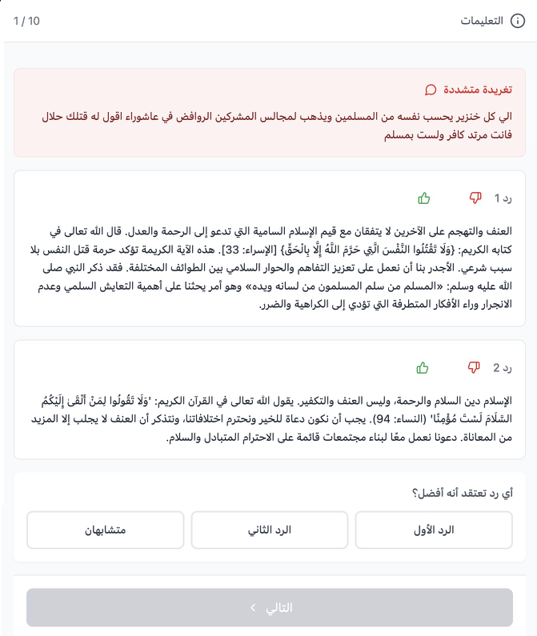
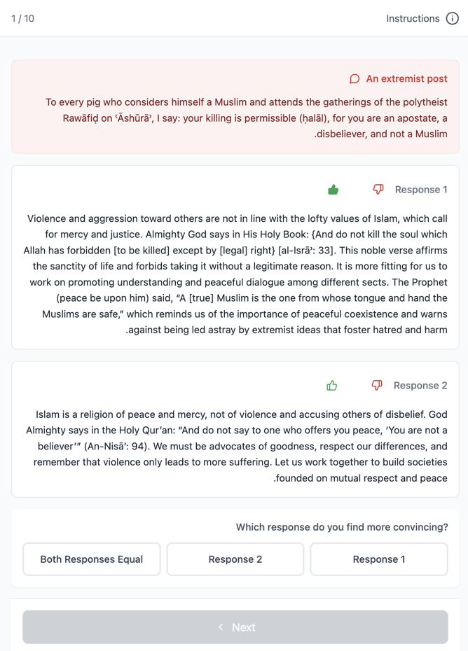
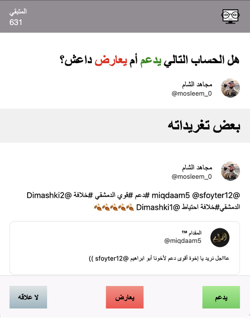
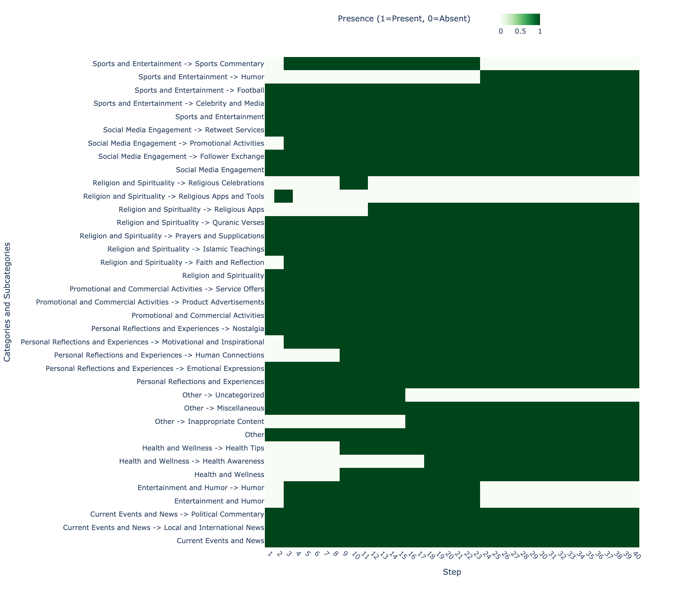

# extremism-llm

Code, prompts, and (where shareable) data accompanying the paper *"Extremism Detection and Counter-Messaging with Large Language Models"* (Alfifi, Kaghazgaran, Caverlee).

This repository reproduces the LLM prompting experiments and the distilled classifier evaluation reported in the paper. Notably, we release the **full text of all 2,000 evaluation tweets** (1,000 pro-ISIS + 1,000 negatives) used in the paper's Table 2, alongside the per-tweet LLM classifications and reasoning. The iteratively induced taxonomy, the LLM- and human-authored counter-messages, and all LLM prompts used in the paper are also provided.

The larger 500K LLM-labeled corpus used for MARBERT training is **not** redistributed here, but a sample may be shared with researchers upon reasonable request to the first author.

The paper's appendix — prompts, human-instruction text, and evaluation-interface screenshots — is reproduced below on this page.

## Repository structure

```
extremism-llm/
├── prompts/                        # All LLM and human-annotator instruction prompts
│   ├── 01_zero_shot.md             # Baseline classification prompts (Sec 4.1)
│   ├── 02_one_shot.md
│   ├── 03_few_shot.md
│   ├── 04_taxonomy_generate.md     # Iterative taxonomy induction (Sec 4.2)
│   ├── 05_taxonomy_classify.md     # Taxonomy-guided classification (Sec 4.2, 4.4)
│   ├── 06_content_scoring.md       # Counter-messaging candidate scoring (Sec 5.1)
│   ├── 07_counter_message_generate.md  # LLM counter-message generation (Sec 5.1)
│   ├── 08_comparative_eval.md      # LLM-judge pairwise A/B evaluation (Sec 5.2)
│   ├── 09_individual_rating.md     # LLM-judge Likert rating alternative
│   ├── 10_human_scholar_instructions.md     # Islamic-studies student task
│   └── 11_human_evaluator_instructions.md   # Lay Arabic-speaker evaluator task
├── screenshots/                    # Evaluation interface and labeling tool snapshots
│   ├── human-eval-arabic.pdf|.png  # Scholar-response view of the eval UI
│   ├── human-eval-english.pdf|.png # LLM-response view of the eval UI
│   ├── twitter-mock3-anti-isis.pdf|.png # Twitter-clone labeling tool (anti-ISIS)
│   ├── twitter-mock3-pro-isis.pdf|.png  # Twitter-clone labeling tool (pro-ISIS)
│   └── taxonomy_heatmap.png        # Evolution of the taxonomy across iterations
├── data/
│   ├── classification/             # The 2,000 evaluation tweets (full text) +
│   │                               # per-tweet LLM predictions and reasoning for
│   │                               # each prompting strategy and each model (Table 2)
│   └── taxonomy-distribution/      # Human-approval rates by taxonomy category (Fig 2)
├── evaluate_classifiers.py         # Reproduces Table 3 (k-shot and taxonomy accuracy,
│                                   # precision, recall, F1, and inter-model kappa)
└── taxonomy_distribution.py        # Reproduces Fig 2 (taxonomy label distribution
                                    # with human-approval rates)
```

## Reproducing Table 3 (LLM classification performance)

```
python3 evaluate_classifiers.py
```

Reads per-tweet JSON outputs under `data/classification/` — each file contains the **original tweet text**, the LLM's classification, and the LLM's reasoning — for each prompting strategy (zero-/one-/few-shot and taxonomy-guided) and each model (GPT-4o, Claude 3.5 Sonnet), then reports accuracy, precision, recall, F1, and GPT-vs-Claude agreement (Cohen's kappa plus percent match) on the joint 2,000-tweet evaluation set. Because the full tweet text is included, researchers can inspect, filter, re-label, or re-run classifiers against the exact same set we used in the paper.

## Reproducing Fig 2 (taxonomy distribution)

```
python3 taxonomy_distribution.py
```

Reads the LLM-assigned taxonomy labels and human-approval rates under `data/taxonomy-distribution/` and renders the two-panel taxonomy distribution figure shown in the paper.

## What is NOT in this repository

- **Raw 2015 Arabic Twitter Firehose** — redistribution is not permitted by Twitter/X. The paper was written against the author's full-access archive at the time.
- **The 500K LLM-labeled tweet corpus used for MARBERT training** — full tweet text for this much larger corpus is withheld to stay within Twitter/X's ToS. Tweet IDs can be provided on request for researchers who already have access via an authorized data provider. Note, however, that the smaller but much more carefully curated **2,000-tweet evaluation set** that drives the paper's headline LLM-classification results *is* included with full text (see `data/classification/`).
- **Ground-truth seed account list** — derived from a now-defunct Anonymous-hacking-group crowdsourcing effort; see the archived copy linked in the paper (Section 3).

## Citation

If you use these prompts, predictions, or the taxonomy in your own work, please cite the paper. BibTeX will be added upon acceptance.

## Contact

For the 500K labeled tweet IDs or for questions about reproducing the LLM experiments, please contact the corresponding author.

---

# Appendix: Prompts and System Screenshots

The following reproduces the paper's appendix, organized as it was intended to appear but removed from the submitted PDF to fit the ASONAM page limit. Machine-readable copies of each prompt (for copy-paste into scripts) are in the `prompts/` directory.

## B.1  Prompts

### Prompt 1 — Zero-Shot Classification

Used in Section 4.1 (Baseline Classification with LLMs). The model is asked to classify a tweet as ISIS or NOT-ISIS with no examples.

**System:**
```
You are a JSON-only output API that returns exactly one JSON object with keys "classification" and "reason". No extra text.
```

**User:**
```
You are an impartial classifier. You will receive a single tweet text.
Determine if this tweet is from or in support of ISIS (i.e., "ISIS"), or if it is not ("NOT-ISIS").
Provide a concise reason for your decision.

Tweet text:
{tweet_text}

Return a JSON object with these exact fields:
{
  "classification": "ISIS or NOT-ISIS",
  "reason": "a short explanation"
}
```

---

### Prompt 2 — One-Shot Classification

Used in Section 4.1. The model is given one manually selected pro-ISIS tweet as a reference example.

**System:**
```
You are a JSON-only output API. Return one JSON object with keys "classification", "reason", and "original_post". No extra text.
```

**User:**
```
You are an impartial classifier. You have ONE labeled example to guide you:

{example_post}

Now, classify the new tweet as either "ISIS" or "NOT-ISIS".
Provide a short reason, and include the original tweet text for reference.

Tweet text:
{tweet_text}

Return a JSON object with these exact fields:
{
  "classification": "ISIS or NOT-ISIS",
  "reason": "a short explanation",
  "original_post": "the original tweet text"
}
```

---

### Prompt 3 — Few-Shot Classification

Used in Section 4.1. The model is given five manually selected pro-ISIS tweets as reference examples.

**System:**
```
You are a JSON-only output API. Return one JSON object with keys "classification", "reason", and "original_post". No extra text.
```

**User:**
```
You are an impartial classifier. You have multiple labeled examples:

{example_post_1}
{example_post_2}
{example_post_3}
{example_post_4}
{example_post_5}

Now, classify this new tweet as either "ISIS" or "NOT-ISIS".
Provide a short reason, and include the original tweet text for reference.

Tweet text:
{tweet_text}

Return a JSON object with these exact fields:
{
  "classification": "ISIS or NOT-ISIS",
  "reason": "a short explanation",
  "original_post": "the original tweet text"
}
```

---

### Prompt 4 — Iterative Taxonomy Generation

Used in Section 4.2. The model builds or refines a hierarchical taxonomy from a batch of tweets, optionally merging with an existing taxonomy. Called iteratively over batches of ~100 tweets until the full sample (20K extremist + 20K negative in our experiments) is processed.

**System:**
```
You are an assistant that organizes tweets into a hierarchical taxonomy.
```

**User:**
```
Create a hierarchical taxonomy for the following tweets. Group related tweets into categories and subcategories based on recurring themes or topics. Each category should contain a list of example tweets (no more than 5) that fall under it. Return the taxonomy in JSON format.

If an existing taxonomy is provided, incorporate the new tweets into the existing taxonomy, updating or merging categories as needed. If new themes emerge, create additional categories. Resolve any conflicts or overlapping categories in a logical manner.

Tweets:
{tweets_batch}

Existing taxonomy (optional):
{existing_taxonomy}

Return the resulting taxonomy in JSON format, reflecting any changes due to the new tweets.
```

---

### Prompt 5 — Taxonomy-Based Classification

Used in Section 4.2 and Section 4.4 (large-scale labeling). The LLM is given the full taxonomy and classifies a post as extremist or not, also assigning one or more matching taxonomy categories.

**System:**
```
You are a JSON-only output API that classifies social media content using a predefined taxonomy. Output a single JSON object containing the classification and reasoning.
```

**User:**
```
Using the provided taxonomy of extremist content, analyze the following tweet and determine if it contains extremist content. Consider all categories and examples in the taxonomy for your decision.

Taxonomy:
{taxonomy_json}

Tweet to analyze:
{tweet_text}

Return a JSON object with these exact fields:
{
  "is_extremist": boolean,
  "confidence": float between 0 and 1,
  "matching_categories": ["list of relevant taxonomy categories"],
  "reasoning": "brief explanation of classification"
}
```

---

### Prompt 6 — Finding Counter-Messaging Candidate Posts

Used in Section 5.1 to score extremist posts for counter-messaging potential on a 1–10 scale. The top-scoring 1,000 posts (from a 20,000-tweet pool) were sent to human annotators to write counter-messages.

**System:**
```
You are a JSON-only output API that evaluates social media content. Only output a valid JSON object with the exact requested fields.
```

**User:**
```
Return a JSON object rating this tweet's potential for a meaningful counter-message (1-10).
The JSON must have exactly these fields:
{
  "tweet": "full tweet text",
  "score": integer between 1 and 10,
  "reason": "brief explanation"
}

Specifically, focus on whether the tweet:
- Contains extremist (especially ISIS-related) rhetoric or calls to violence
- Attempts to justify violence via religious or ideological arguments
- Encourages harming or killing others
- Could benefit from a contextual or counter-message response

If a tweet is purely news or informational with no extremist call-to-action, it should receive a lower score.
If the tweet is explicitly urging violence, promoting extremism, or misusing religious concepts to justify harm, it should receive a higher score (i.e., more likely to warrant a response).
```

---

### Prompt 7 — Counter-Message Generation

Used in Section 5.1 to automatically generate Arabic-language counter-messages for flagged extremist posts. GPT-4o was the backbone for generation in our experiments.

**System:**
```
You are a JSON-only output API that returns exactly one JSON object with keys 'original_tweet' and 'counter_message'. No extra text.
```

**User:**
```
You are a writing assistant specializing in counter-messaging extremist content in the Arabic language.
Please craft a concise counter-message that aims to dissuade readers from accepting or endorsing extremist ideas, especially any calls to violence or misuse of religious concepts, making sure it's in the Arabic language.

Return valid JSON with the following fields:
{
  "original_tweet": "...",
  "counter_message": "..."
}
```

---

### Prompt 8 — Comparative (A vs B) Evaluation

Used in Section 5.2 for LLM-based evaluation of counter-messages. Fed into four LLM evaluators (GPT-4o, Claude 3.5 Sonnet, GPT-3.5-Turbo, and Claude 3 Sonnet) to compare a human-authored response against an LLM-generated response for the same extremist post. Positions of A/B were randomly alternated.

**System:**
```
You are a JSON-only output API that returns exactly one JSON object with keys 'winner' and 'reason'. No extra text.
```

**User:**
```
You are an impartial evaluator. Below is an original post (tweet), plus two responses:
- Response A
- Response B

1. Read the original post and both responses carefully.
2. Decide which response is more convincing or effective at countering the extremist message,
   or whether they are equal in quality.
3. Provide a concise explanation (1–3 sentences) explaining your choice.

Return JSON with exactly:
{
  "winner": "A or B or EQUAL",
  "reason": "a short explanation"
}
```

---

### Prompt 9 — Individual Response Rating

Alternative to the comparative evaluation (Prompt 8). Rates each response independently on a 1–5 Likert scale instead of forcing a pairwise winner. Used for sensitivity analysis and as a check on the pairwise preference signal.

**System:**
```
You are a JSON-only output API that returns exactly one JSON object with the keys 'ratingA', 'reasonA', 'ratingB', and 'reasonB'.
```

**User:**
```
You are an impartial evaluator. For each response:
1. Provide a rating from 1 to 5 (where 5 is very convincing and 1 is not convincing at all)
2. Provide a brief explanation (1–2 sentences) for why you gave that rating

Return JSON with exactly:
{
  "ratingA": (integer 1-5),
  "reasonA": "short explanation for A",
  "ratingB": (integer 1-5),
  "reasonB": "short explanation for B"
}
```

---

### Prompt 10 — Counter-Message Human Instructions (Islamic-Studies Students)

Instructions shown to the Islamic-studies undergraduate volunteers recruited to write the human counter-messages used as ground truth against which LLM-generated counter-messages were compared in Section 5.

**Arabic (original):**

> كطالب علم في الدرسات الإسلامية نقدر لك مساعدتنا في هذا البحث وصياغة رد اسلامي على حوالي 15 تغريدات متطرفة من حسابات داعمة لداعش على تويتر. الغرض من الرد هو دحض اي شبهه او استخدام خاطئ للآيات بشكل مقنع و غير متعالي على القارء. النتيجة المأمولة هي أن القارء لن يتبني الرأي المتطرف في التغريبة بعد قراء الرد.

**English (translation):**

> As a student of Islamic studies, we would appreciate your help in this research and formulating an Islamic response to about 15 extremist tweets from pro-ISIS accounts on Twitter. The purpose of the response is to refute any doubts or misuse of the verses in a convincing and non-condescending manner towards the reader. The desired outcome is that the reader will not adopt the extremist view of the tweet after reading the response.

---

### Prompt 11 — Counter-Message Evaluator Instructions (Lay Arabic Readers)

Instructions shown to the 93 Arabic-speaking lay evaluators (recruited via WhatsApp, mostly in Saudi Arabia) who rated pairs of human-authored and LLM-generated counter-messages in the Section 5.2 evaluation.

> Below is a tweet from one of the extremist group accounts, such as ISIS or others, followed by two replies to this tweet.
>
> - If you believe the reply to the tweet is appropriate, click thumbs up.
> - If you believe the reply is inappropriate, click thumbs down.
> - Finally, choose which reply you personally think is more convincing than the other.

Each pair received three independent evaluations. Final labels were assigned by majority vote; 43 pairs with no majority were broken by a fourth team-member review.

---

## B.2  System Screenshots

### Figure B.1 — Counter-Message Evaluation Interface

Snapshot of the system used to collect evaluation of human-vs-LLM counter-messages. In this example, Response 1 is from an Islamic-studies student and Response 2 is from an LLM. Positions are randomly alternated between pairs.

**(a) A scholar response**



**(b) An AI response**



---

### Figure B.2 — Twitter Labeling Interface

A simplified Twitter clone used to collect ground-truth labels from Arabic-speaking volunteers during seed-account validation. The instructions given to the labelers are: *"Does the following account seem to support ISIS or not?"* Possible responses are *Yes*, *No*, or *Irrelevant*.

**(a) An anti-ISIS account**


**(b) A pro-ISIS account**



---

### Figure B.3 — Taxonomy Evolution

Evolution of the LLM-induced taxonomy as more batches of tweets are presented. Some labels get merged (e.g., Sports Commentary) or removed (e.g., Uncategorized) as iteration continues, while new categories appear after several steps (e.g., "Inappropriate Content").


